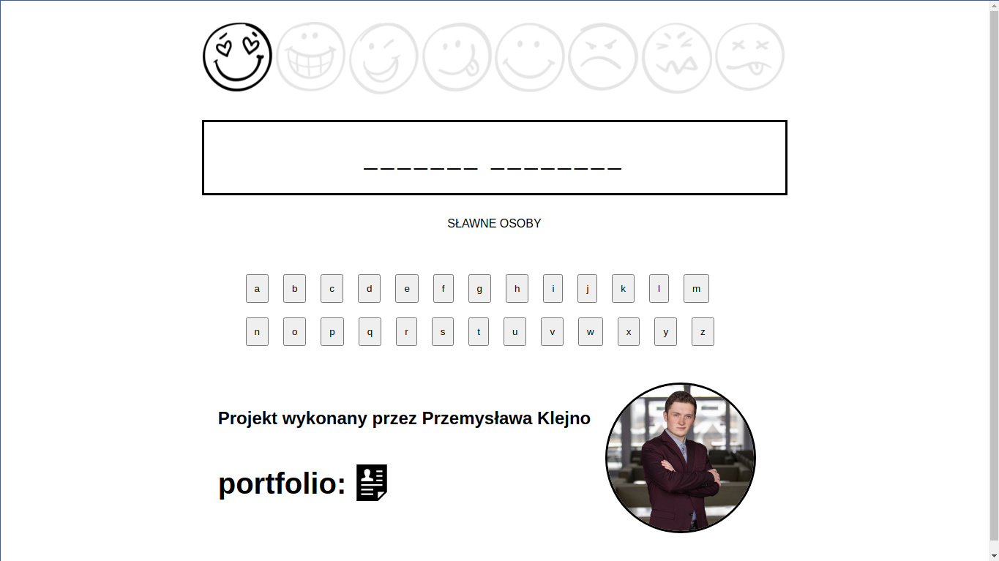
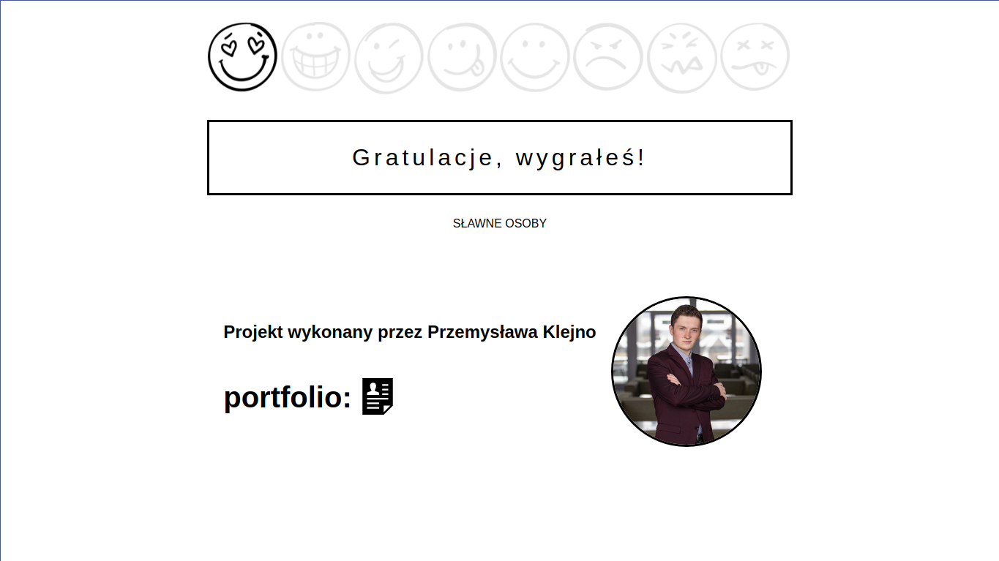
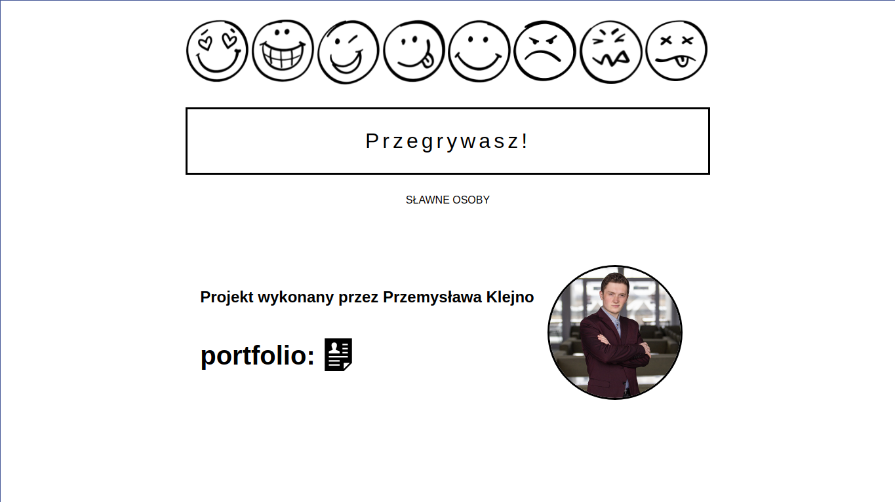

# Hangman
Simple JavaScript game.

## Description
Game aim is to guess all letters in the quote. Every quote has it's own category,
which is displayed on the screen to help user guess the quote. The game ends if
user succeeds in guessing all letters of quote or if user chooses too many letters.

## screenshots:

### game:

### win

### loose

## Technologies used:
- JavaScript
- HTML5
- CSS

## Where to play?
https://pemix09.github.io/Hangman/